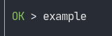

# @flowtr/test

A test runner that supports ESM and typescript by using esbuild and vm2.

## Usage

Create a file named `NAME.test.ts`, replacing the `NAME` with your test file name.

```typescript
import { expect } from "@flowtr/test";

// Export some tests
export default [
    {
        name: "example",
        fn: async () => {
            await expect("hello world!").toEqual("hello world!");
        },
    },
];
```

Now you can run the tests.

```bash
fltest
```



Keep in mind that the tests must be async functions so that expect can be awaited.

## Browser Support

It should also the support browsers when using the expect function by itself.
Let us know if there's any issues with browser support.
We recommend rollup to bundle the npm modules into a browser bundle.
